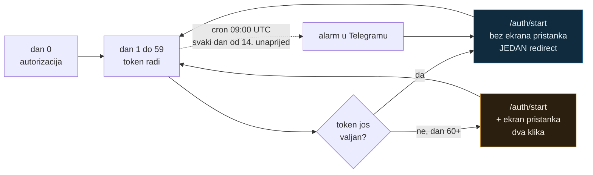

# Postavljanje od nule i zamke koje su koštale vremena

Zapisano 2026-08-27, na dan kad je servis prvi put objavio post. Ovdje je ono što
se **ne vidi iz koda ni iz git povijesti**: mjerenja, odbačene pretpostavke i tihi
kvarovi. Za ono što servis radi vidi [`../README.md`](../README.md).

## Stanje instance

| | |
|---|---|
| LinkedIn app | `italk-poster-ms`, App ID `264334189`, Page ITalk |
| Client ID | `77pkxs9hy8kfiy` (nije tajna, putuje u authorization URL-u) |
| Worker | `linkedin-poster` → `li.domovina.ai` + `linkedin-poster.d-o-m.workers.dev` |
| KV `TOKENS` | `af0017dbbf5c4b438942d16166327cd1`, preview `9ca597ad40894d9aac5c51fbe92f9380` |
| Autoriziran kao | Matija Stepanić, `urn:li:person:l7GKfir2K-` |
| Prvi post | `urn:li:share:7498639442082111488`, 2026-08-27 |

## Ograničenje koje određuje arhitekturu

Portal to potvrđuje crno na bijelo pod Auth → OAuth 2.0 settings:

> Access token: **2 months (5184000 seconds)**

A dokumentacija dodaje da su **programski refresh tokeni samo za odobrene
Marketing Developer Platform partnere**. Self-serve „Share on LinkedIn" app ih
nikad ne dobije, pa se token **ne može** obnoviti bez preglednika.

Tiha obnova radi, ali samo pod dva uvjeta istovremeno: token **još nije istekao**
i korisnik je prijavljen na linkedin.com. Tada `/oauth/v2/authorization` preskoči
ekran pristanka i samo redirecta.



Zato cron postoji. Bez njega se propusti prozor u kojem je obnova jedan klik, i
sljedeći put ide puni ekran pristanka.

## Zamke u LinkedIn portalu

**Riječ „LinkedIn" nije dozvoljena u imenu aplikacije.** Prvi pokušaj
`linkedin-poster` odbijen je s `'LinkedIn' is not allowed. Choose a different
application name.` Ime repoa i ime aplikacije zato se razlikuju.

**Vezanje na LinkedIn Page je nepovratno.** Forma to piše, ali tek nakon što
upišeš ime: *„This action can't be undone once the app is saved."* Page ne smije
biti osobni profil, mora biti Company Page kojoj si admin.

**Logo je obavezan**, kvadratan, barem 100 px. Nema preskakanja.

**Scopeovi se ne pojave odmah.** Nakon dodavanja oba produkta Auth tab je i dalje
pokazivao `No permissions added`. Tek osvježavanje stranice popuni popis. Da smo
u tom trenutku pokušali autorizaciju, dobili bismo `401 Invalid scope` koji
izgleda kao greška u kodu, a nije.

**Samo su dva produkta samoposlužna** (Open Permissions): *Sign In with LinkedIn
using OpenID Connect* i *Share on LinkedIn*. Od preostalih jedanaest, deset ima
zasivljen gumb i traži odobrenje kroz Access Request Form, a jedanaesti
(*LinkedIn Ad Library*) ima aktivan gumb ali vodi na Qualtrics formu, dakle ni on
nije instant. LinkedIn izrijekom odobrava samo aplikacije s relevantnim use
caseom, pa **ne traži produkte koje ne koristiš** — prazan zahtjev kvari izglede
za onaj koji zatreba.

## Zamke u API-ju

**`scope` se mora kodirati s `%20`, ne s `+`.** `URLSearchParams` daje `+`, a
LinkedIn tada vraća `401 Invalid scope`. Simptom izgleda kao kriva konfiguracija
u portalu, pa se sat vremena traži na krivom mjestu. Vidi komentar u
[`../src/linkedin.ts`](../src/linkedin.ts).

**`/v2/ugcPosts` je deprecated**, koristi se versionirani `/rest/posts`. Header
`LinkedIn-Version` je obavezan, u obliku `YYYYMM`, i verzije se gase otprilike
godinu dana nakon izlaska. `202508` je pao **17. kolovoza 2026**, devet dana prije
ovog postavljanja. To je stavka za održavanje, ne konstanta.

**Goli URL se ipak pretvara u link.** Ranija pretpostavka u ovom repou bila je da
ostaje običan tekst jer Posts API ne scrapea URL-ove. Provjereno na živom postu:
LinkedIn ga skrati u `lnkd.in/…` i učini klikabilnim. Ono što **izostaje** je samo
preview kartica sa slikom i naslovom. Za nju treba Images API za thumbnail plus
`content.article` blok.

**150 zahtjeva po članu dnevno**, ne po aplikaciji.

## Zamke izvan LinkedIna

**Negativni DNS keš na svježoj custom domeni.** Upit za `li.domovina.ai` poslan je
prije nego je zapis postojao, pa je resolver zapamtio NXDOMAIN. Posljedica je bila
zbunjujuća: `dig` je vraćao ispravne IP-eve (ide direktno na nameserver), a `curl`
i Node su javljali `ENOTFOUND` (idu kroz sistemski keš). Ruta i TLS su cijelo
vrijeme radili, što je dokazano s:

```bash
curl --resolve li.domovina.ai:443:104.21.39.92 https://li.domovina.ai/   # HTTP 200
```

Prođe samo, ili odmah s `sudo dscacheutil -flushcache && sudo killall -HUP mDNSResponder`.
**Pouka: ne gađaj ime domene prije nego je zapis stvoren.**

**`compatibility_date` ne smije prestići pinani runtime.** Postavljen na današnji
`2026-08-27` uz workerd `1.20260825.1`, `wrangler dev` je pao s
`Compatibility date "2026-08-27" is in the future and unsupported`. Drži ga na
datumu koji runtime prihvaća i podiži ga zajedno s dependencyjem.

**Propagacija tajni nije trenutna.** Nakon `wrangler secret put SETUP_KEY` stara
je vrijednost još jednom prošla, pa tek onda počela vraćati 403. Ako rotiraš ključ
iz sigurnosnih razloga, **provjeri da je stari doista mrtav** umjesto da
pretpostaviš.

Ponovilo se isti dan pri postavljanju `TELEGRAM_BOT_TOKEN` i `TELEGRAM_CHAT_ID`:
oba puta je Worker nakon uspješnog `wrangler secret put` još nekoliko sekundi
tvrdio da tajna **nije postavljena**. Dvije pojave od dvije, dakle to nije
anomalija nego ponašanje na koje treba računati. Ne traži grešku u kodu prvih
pola minute, nego čekaj u petlji:

```bash
until curl -s "$URL" | grep -q '"sent": true'; do sleep 5; done
```

**`wrangler kv key put --local` ne piše u isti KV koji vidi `wrangler dev`.**
Pokušaj da se lokalni KV napuni tokenom prije pokretanja dev servera prošao je
bez greške, a `wrangler dev` je i dalje javljao da tokena nema. Razlog: CLI piše
u vlastiti direktorij pod `.wrangler/state/v3/kv/<namespace>`, dok dev server
koristi miniflareov `miniflare-KVNamespaceObject`. `wrangler kv key list --local
--binding TOKENS` vraća `[]` i nakon uspješnog `put`, što potvrđuje da su to dva
odvojena spremnika.

Tiho je jer nijedna strana ne prijavlja grešku. **Ne pokušavaj seedati lokalni
KV kroz CLI**; napuni ga kroz sam Worker (rutu koja piše) ili provjeru odradi na
deployanoj instanci, gdje je KV ionako pravi.

## Postupanje s tajnama

Usvojeno u ovoj sesiji i vrijedi dalje:

- `LINKEDIN_CLIENT_SECRET` unosi **čovjek** kroz `wrangler secret put`, koji ne
  ispisuje unos. Agent ga ne čita niti upisuje.
- `API_TOKEN` i `SETUP_KEY` generiraju se u `.dev.vars` (gitignoran, mode 600) i
  odatle pipeaju u `wrangler secret put`, pa nikad ne prođu kroz ispis.
- `Client ID` nije tajna, javno putuje u authorization URL-u.
- Ako ključ ipak završi u ispisu, **rotiraj ga odmah** i potvrdi da stari vraća
  403. Napravljeno jednom ovdje, jer je `SETUP_KEY` morao ući u URL da bi se
  navigirao kontrolirani tab.

## Vezani dokumenti

- [`../README.md`](../README.md) — što servis radi i kako se instalira
- [`2026-08-27-telegram-obavijesti.md`](2026-08-27-telegram-obavijesti.md) —
  Telegram sloj, migracija u supergrupu i podsjetnik na obnovu tokena
- `~/.claude/CLAUDE.md` — pravilo o pinanju preglednika i zabrani `open` za URL
  koji treba pratiti
