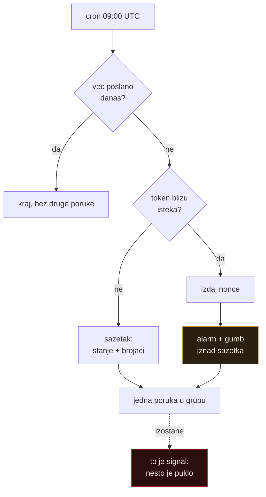

# Telegram sloj: da servis sam javi kad je u kvaru

Zapisano 2026-08-27, isti dan kad je servis prvi put objavio post. Ovdje je
**zašto** obavijesti izgledaju baš ovako, i koje su zamke već plaćene u
`~/git/italk/javna-nabava`, pa ih ovdje ne treba otkrivati ponovno. Za ono što
servis radi vidi [`../README.md`](../README.md), za postavljanje od nule
[`2026-08-27-postavljanje-i-zamke.md`](2026-08-27-postavljanje-i-zamke.md).

## Stanje instance

| | |
|---|---|
| Bot | `@ms_social_poster_bot`, prikazno ime `ms-social-poster-bot` |
| Grupa | `ms-social-poster`, `chat_id` `-1004295957021` |
| Tajne | `TELEGRAM_BOT_TOKEN`, `TELEGRAM_CHAT_ID` na Workeru |
| Prva poruka | 2026-08-27, isti dan kad je servis proradio |

## Problem koji ovo rješava

Token traje 60 dana i **ne može se obnoviti programski**. Bez podsjetnika istek
se sazna lijeno, na dan kad objava padne, a tada je prozor za tihu obnovu već
zatvoren i vraća se ekran pristanka. Cron je za to postojao od prvog dana, ali
`NOTIFY_WEBHOOK` nije bio postavljen nigdje, pa je podsjetnik odlazio u
`console.warn` koji nitko ne čita.

Drugi problem je općenitiji: servis koji tiho ne radi izgleda isto kao servis
koji nema posla.

## Dva obrasca preuzeta iz javna-nabave

### 1. Grupa postane supergrupa i dobije novi chat_id

Puni opis je u [`~/git/italk/javna-nabava/docs/telegram-supergroup.md`](file:///Users/ms/git/italk/javna-nabava/docs/telegram-supergroup.md).
Ukratko: obična grupa se sama od sebe nadogradi u supergrupu (dodavanje admina,
uključivanje povijesti, rast broja članova), Telegram joj dodijeli **novi
`chat_id`**, a stari **trajno** vraća `400` s `parameters.migrate_to_chat_id`.

To je tihi pad u najgorem obliku: cron radi, izlazi s kodom 0, logovi čisti,
nitko ne prima poruke. Točno onaj kvar zbog kojeg ovaj sloj postoji.

[`../src/telegram.ts`](../src/telegram.ts) hvata id iz odgovora, ponavlja slanje
**u istom pokušaju** i zapiše novi id. Jedina razlika u odnosu na javna-nabavu:
Worker nema `.env` koji bi prepisao, pa novi id ide u KV pod
`telegram:chat-id`, odakle ima prednost nad konfiguriranim `TELEGRAM_CHAT_ID`.

Ovaj put se nikad ne izvrši dok se ne dogodi, a tada je prekasno za otkrivanje
greške, pa je testiran protiv lokalnog lažnog Bot API-ja:

```bash
npm run test:telegram
```

`scripts/test-telegram.ts` odigra migraciju, rate limit, ispad i izbacivanje
bota iz grupe. Nema test frameworka: Node skida tipove, a `src/telegram.ts`
nema nijedan import, pa se učitava takav kakav jest.

**Zapažanje iz ovog postavljanja:** grupa stvorena 2026-08-27 kroz Telegram
klijent **odmah je bila supergrupa**, `chat_id` `-1004295957021`, prije nego je
u nju išta poslano. Migracija se dakle možda nikad neće dogoditi na ovoj
instanci. Rukovanje ipak ostaje: postojeće obične grupe se i dalje nadograđuju,
a cijena koda je nekoliko redaka naspram tihog pada koji traje mjesecima.

### 2. Dnevni sažetak kao heartbeat

Sažetak ide **svaki run**, i na dan kad se nije dogodilo baš ništa. Time
**izostanak poruke sam po sebi postaje signal**, bez uptime monitoringa i bez
išta što bi nadziralo nadzornika.

Iz toga slijedi pravilo o ritmu: **točno jedna poruka po jutru**. Na dane kad je
obnova blizu, alarm se stavlja **na vrh istog sažetka** umjesto da ode kao druga
poruka. Dvije poruke dnevno bi naučile oko da preskače obje.



## Zašto gumb za obnovu ne nosi SETUP_KEY

Prva verzija linka bila bi `/auth/start?key=<SETUP_KEY>`. Radi iz prve, ali
**trajno parkira dugovječnu tajnu u chat povijesti** i na Telegramovim
serverima, gdje ostaje i nakon što je poruka odavno odrađena.

Umjesto toga cron izda **nonce** u KV pod `renew:nonce`, a link glasi
`/auth/start?t=<nonce>`. Svojstva:

- vrijedi 7 dana, koliko je najveći razmak između dva podsjetnika (14 i 7 dana),
  pa starija poruka ne nosi mrtav link;
- svako novo izdavanje **zamijeni prethodni**, pa radi samo najnovija poruka;
- **briše se čim se token spremi**, pa poruka na koju se netko vrati za mjesec
  dana više ne otvara autorizaciju;
- izdaje se **samo na dane kad se nudi**, pa sedam tjedana u KV ne stoji živ
  nonce koji nikome ne treba.

`SETUP_KEY` i dalje radi na `/auth/start?key=`, za čovjeka za tipkovnicom.

**Zamka koja ide uz ovo:** Telegram sam dohvaća linkove radi preview kartice, a
to bi potrošilo jednokratni nonce prije nego ga itko takne. Zato svaka poruka
ide s `link_preview_options: { is_disabled: true }`. Isti razlog zbog kojeg u
javna-nabavi stoji `disable_web_page_preview`, ali ovdje s oštrijom posljedicom.

## Što ide u grupu

| Događaj | Kad | Poruka nosi |
|---|---|---|
| Dnevni sažetak | svaki cron, 09:00 UTC | dana do isteka, brojači, popis objava |
| Alarm za obnovu | 14 dana pa nadalje, i nakon isteka | gumb s jednokratnim linkom |
| Obnova uspjela | nakon `/auth/callback` | tko je spojen i novi datum isteka |
| Objava uspjela | svaki post | isječak, vidljivost, izvor, link na post |
| Linter odbio | 422 ili odbijanje kroz MCP | koja su pravila pukla i isječak |
| LinkedIn odbio | 4xx/5xx s Posts API | status, tijelo, i pretpostavka uzroka |
| Nema živog tokena | pokušaj objave na 503 | da objava nije izašla i zašto |
| Dnevna kvota | prijelaz 120 od 150 | koliko je potrošeno, jednom dnevno |
| Odbijeni pristupi | krivi ključ ili bearer | samo brojka, u dnevnom sažetku |

Odbijeni pristupi namjerno **ne** idu kao zasebna poruka. Pojedinačan promašaj
je šum; dnevna brojka je uzorak, i vidi se na mjestu gdje se ionako gleda.

## KV ključevi koje ovaj sloj koristi

| Ključ | Sadržaj | Život |
|---|---|---|
| `telegram:chat-id` | id usvojen nakon migracije u supergrupu | trajno |
| `renew:nonce` | jednokratni ključ iz gumba za obnovu | 7 dana |
| `stats:YYYY-MM-DD` | brojači dana i zadnjih 8 objava | 7 dana |
| `last-renewal-notice` | datum zadnjeg sažetka, protiv dvostrukog crona | 2 dana |

Brojači su brojači, ne revizijski trag. KV je eventually consistent i
istovremeni `bump` može progutati inkrement. Na nekoliko objava dnevno to je
zaokruživanje, i ništa nizvodno ne donosi odluku koju bi izgubljena jedinica
promijenila. Ono što se ne smije izgubiti ide u log.

## Postavljanje od nule

1. **Bot.** U Telegramu otvori [@BotFather](https://t.me/BotFather), pa
   `/newbot`. Ime po volji, username mora završavati na `bot`. Vrati token u
   obliku `123456789:AA...`.
2. **Grupa.** Nova grupa, dodaj bota kao člana. Pošalji u nju
   `/start@imebota` **prije** sljedećeg koraka: bot s privacy mode ON (to je
   default) vidi samo poruke koje ga spominju, pa bez toga `getUpdates` vraća
   prazno.
3. **Tajne.** Token nikad ne prolazi kroz ispis:
   ```bash
   npx wrangler secret put TELEGRAM_BOT_TOKEN   # zalijepi, unos se ne ispisuje
   ```
4. **chat_id.** Otvori `https://li.domovina.ai/telegram/chatid?key=<SETUP_KEY>`.
   Vrati popis chatova koje je bot vidio. Uzmi id grupe i spremi ga:
   ```bash
   npx wrangler secret put TELEGRAM_CHAT_ID
   ```
5. **Provjera.** `https://li.domovina.ai/telegram/test?key=<SETUP_KEY>` pošalje
   testnu poruku i vrati je li prošla.

## Alati za kasnije

`/telegram/preview?key=<SETUP_KEY>&kind=daily` prikaže poruku **bez slanja**, pa
se tekst može mijenjati bez zatrpavanja grupe. `&send=1` je ipak pošalje, jer se
formatiranje vidi tek na mobitelu. `&kind=` prima `daily`, `posted`,
`lint_blocked`, `linkedin_rejected`, `no_token`, `reconnected`, `quota`, a
`&renewal=1` prisili alarm i na dan kad nije potreban.

To je ujedno jedini način da se dnevni sažetak vidi izvan 09:00 UTC.

## Vezani dokumenti

- [`../README.md`](../README.md) — što servis radi i kako se instalira
- [`2026-08-27-postavljanje-i-zamke.md`](2026-08-27-postavljanje-i-zamke.md) —
  zamke LinkedIn portala, API-ja i Cloudflarea
- `~/git/italk/javna-nabava/docs/telegram-supergroup.md` — izvorni zapis o
  migraciji u supergrupu
